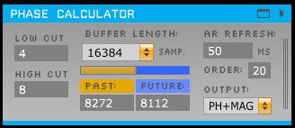
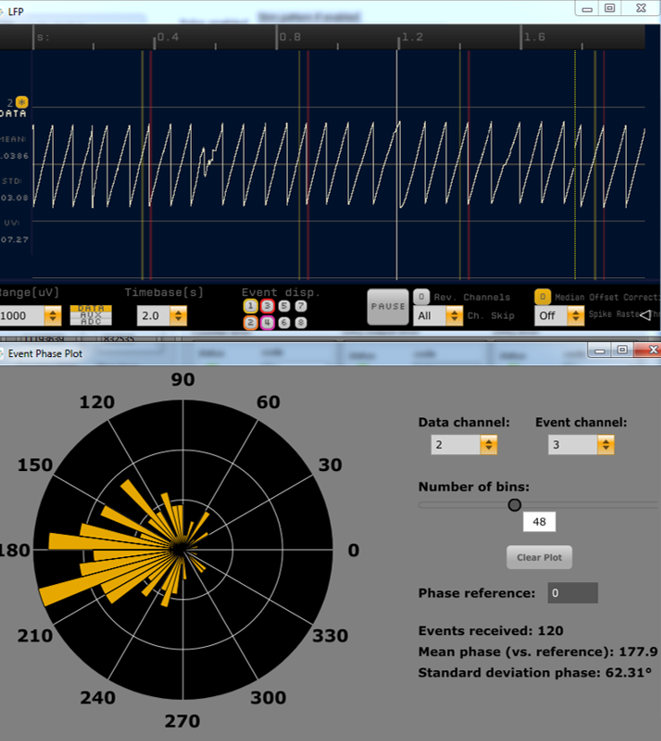

# Phase Calculator Plugin

A plugin for the [Open Ephys GUI](https://github.com/open-ephys/plugin-GUI) to estimate the phase of inputs within a specified passband in real time. Its primary purpose is to enable closed-loop stimulation, typically in combination with the [Crossing Detector](https://github.com/tne-lab/crossing-detector) and either the Pulse Pal or an external stimulation system that receives ZeroMQ events (for example, the LabVIEW implementation [here](https://github.com/tne-lab/closed-loop-stim)). It can also output the magnitude or imaginary component of the band-limited analytic signal instead of the phase. (The "PH+MAG" mode outputs both phase and magnitude, in separate channels.) Finally, the visualization tab or window can receive TTL events and display the delayed but precise phase of a specified input at the event onset samples in a rose plot. This allows real-time monitoring of stimulation accuracy.

The closed-loop system incorporating this plugin is described in the following article, which should be cited in future publications:

Blackwood, E., Lo, M., Widge, A. S. (2018). Continuous phase estimation for phase-locked neural stimulation using an autoregressive model for signal prediction. 40th International Conference of the IEEE Engineering in Medicine and Biology Society, in press.

 

## Installation

(Instructions here are for Windows and Linux - Mac support may be coming soon.)

The Phase Calculator depends on a Discrete Fourier Transform library called FFTW (version 3). For Windows, the precompiled version is included here. On Linux, it can be installed from source or possibly from your distribution's package manager.

Here it is assumed that you are adding the Phase Calculator to an existing `plugin-GUI` repository. It must be new enough to have the `DspLib` common library, which was introduced on Feb 8, 2018 on the development branch (commit `2dcb98b...`).

### All platforms:

* Create the directory `plugin-GUI/Source/Plugins/PhaseCalculator` and copy all contents of `Source` into it.

### Windows (Visual Studio 2013)

* Create the directory `plugin-GUI/Builds/VisualStudio2013/Plugins/PhaseCalculator`and copy all contents of `Builds/VisualStudio2013` into it.

* Copy the contents of `Resources/DLLs/VS2013` and `Resources/DLLs/VS2013-x64` into the corresponding directories in your `plugin-GUI` repository.

* Copy `Resources/windows-libs/FFTW` into `plugin-GUI/Resources/windows-libs`.

* Open `plugin-GUI/Builds/VisualStudio2013/open-ephys.sln` and build as normal for your target build configuration(s).

* Open `plugin-GUI/Builds/VisualStudio2013/Plugins/Plugins.sln`. Right-click on the solution in Solution Explorer, select `Add -> Existing Project...`, and open `plugin-GUI/Builds/VisualStudio2013/Plugins/PhaseCalculator/PhaseCalculator.vcxproj` to add it to the solution. Then build as normal.

### Linux

* You need to install FFTW 3 (if not already present) into the standard library/header locations. See [here](http://www.fftw.org/download.html) for instructions on building from source. Many distributions may also provide FFTW 3 available in their package repositories. For instance, Ubuntu/Debian/Linux Mint provide the package `libfftw3-dev` (available on Ubuntu 14.04 "trusty" and later). The package on Arch Linux appears to be called simply `fftw`.

* Once FFTW is installed, compile as usual with `make -f Makefile.plugins PhaseCalculator`.

## Usage

### Main functionality

* ***Important!*** Since the phase estimation algorithm is somewhat processor-intensive, by default all input channels are disabled. To enable the channels you would like to estimate the phase (or other component) of, select them in the "PARAM" section of the drawer. If "PH+MAG" is selcected as the output, this will also create the additional magnitude outputs for each selected input.

* Use "Low cut" and "High cut" to select the desired frequency passband. (Inputs should be unfiltered; the Phase Calculator uses its own bandpass filter.)

* The "Buffer length," "Past," and "Future" settings control the size and contents of the "Hilbert buffer" that is passed through the Hilbert transform to get the analytic (complex) signal for each channel. The "Past" length is the number of received samples to include on each iteration, including the current "processing buffer" (buffer of new data, whose size can be changed in the Audio Settings). The "Future" length is the number of samples of band-limited signal predicted using an autoregressive model to include. (See Blackwood, Lo & Widge, 2018 (once published) for more explanation of the algorithm.) The defaults are reasonable for a 4-8 Hz passband with a short processing buffer size. A longer buffer length generally increases the estimation accuracy at the cost of greater processing time. Also, one should optimally center the last (current) processing buffer of "past" data within the Hilbert buffer by setting "Future" to half of "Buffer Length" minus half of the processing buffer size. This ensures the maximal accuracy of the region of the Hilbert output corresponding to the current buffer.

* "AR Refresh" and "Order" control the autoregressive model used to predict the "future" portion of the Hilbert buffer. AR parameters are estimated using Burg's method. The default settings seem to work well, but other settings (particularly lower orders) may also work well.

* "Output" allows selection of which component(s) of the analytic signal to output (for all enabled channels). If PH+MAG is selected, a magnitude (amplitude envelope) output channel is added to the outputs for each selected input channel; they appear in the ascending numerical order of their corresponding input/phase output channels. See `PC_ph+mag_demo.png` for an example of outputtng both phase and magnitude.

### Event phase visualization

Clicking the tab or window button opens the "event phase plot" view. This allows non-real-time plotting of the precise phase of received TTL events on a channel of interest. The data channel must be one that is selected for processing in the Phase Calculator "params" drawer, as the filtering step is shared between real-time phase estimation and event phase visualization. All plot controls can be used while acquisition is running. "Phase reference" subtracts the input (in degrees) from all phases (in both the rose plot and the statistics).

I hope you find this to be useful!
-Ethan Blackwood ([ethanbb](https://github.com/ethanbb))
