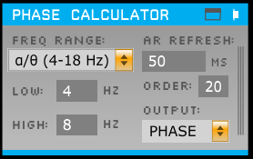
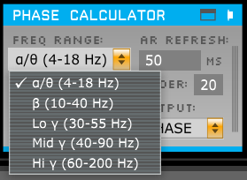
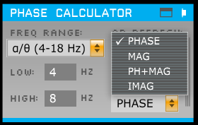
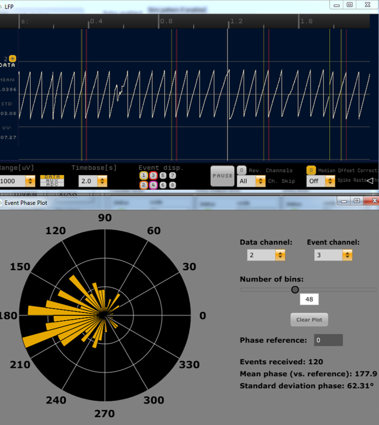

# Analytic Signal Plugin 

A plugin for the [Open Ephys GUI](https://github.com/open-ephys/plugin-GUI) to estimate the analytic signal of inputs within a specified passband in real time. Its primary purpose is to enable closed-loop stimulation, typically in combination with the [Crossing Detector](https://github.com/tne-lab/crossing-detector) and either the Pulse Pal or an external stimulation system that receives ZeroMQ events (for example, the LabVIEW implementation [here](https://github.com/tne-lab/closed-loop-stim), or Python implemention). It can  output the phase, magnitude or imaginary component of the band-limited analytic signal. (The "PH+MAG" mode outputs both phase and magnitude, in separate channels.) Finally, the visualization tab or window can receive TTL events and display the delayed but precise phase of a specified input at the event onset samples in a rose plot. This allows real-time monitoring of stimulation accuracy.

See the following github page and article that describes current implementation and assitance with setting up closed loop experiments. [Github repo](https://github.com/tne-lab/TORTE) and Article(in progress).

The `development` branch of the Analytic Signal plugin provides two different algorithms to choose from. The The Hilbert Transformer algorithm is described in the above article. The State Space algorithm is still in a beta state and most likely still has some bugs present. See the State Space algorithm described in this [article](https://www.biorxiv.org/content/10.1101/2021.03.25.437024v1):

"A State Space Modeling Approach to Real-Time Phase Estimation"
Anirudh Wodeyar, Mark Schatza, Alik S. Widge, Uri T. Eden, Mark A. Kramer.
bioRxiv 2021.03.25.437024; doi: https://doi.org/10.1101/2021.03.25.437024

The following article describes the algorithm used by the **previous version** of this plugin and the closed-loop stimulation pipeline as a whole:

Blackwood, E., Lo, M., Widge, A. S. (2018). Continuous phase estimation for phase-locked neural stimulation using an autoregressive model for signal prediction. 40th International Conference of the IEEE Engineering in Medicine and Biology Society (EMBC), Honolulu, HI, 4736-4739.

If you are just using the plugin in your project, you can cite this version of the code using the DOI listed in the header of this file.

## Versions

* You are on the `development` branch, which aprovides two algorithms to extract the analytic signal. The [SSPE](https://www.biorxiv.org/content/10.1101/2021.03.25.437024v1) which creates a model of the system and estimates the analytic signal using a kalman filter and the [Hilbert transformer](https://www.intechopen.com/books/matlab-a-fundamental-tool-for-scientific-computing-and-engineering-applications-volume-1/digital-fir-hilbert-transformers-fundamentals-and-efficient-design-methods) FIR filter - actually one of several, depending on the frequency band you are filtering to. This is more efficient than the original (published) algorithm since it doesn't require as much AR model-based prediction nor calculating an FFT on each step.

* If you want, you can switch to the `old-version` branch, which uses the Fourier-transform-based [Hilbert transform](https://en.wikipedia.org/wiki/Hilbert_transform) over a sliding window to estimate the analytic signal (from which we derive the phase). We have been testing variants of this algorithm in our lab since mid-2016, and it is now fairly polished, but is somewhat less computationally efficient than the newer version.

## Installation

This plugin must now be built outside of the main GUI file tree using CMake. In order to do so, it must be in a sibling directory to plugin-GUI\* and the main GUI must have already been compiled.

You should use this branch if you are already using CMake to build the *main GUI* (in development as of writing). Otherwise, use the `old-gui` branch.

You must also first install the "OpenEphysFFTW" common library, available [here](https://github.com/tne-lab/OpenEphysFFTW/tree/cmake-gui).

See `PhaseCalculator/CMAKE_README.txt` and/or the wiki page [here](https://open-ephys.atlassian.net/wiki/spaces/OEW/pages/1259110401/Plugin+CMake+Builds) for build instructions.

\* If you have the GUI built somewhere else, you can specify its location by setting the environment variable `GUI_BASE_DIR` or defining it when calling cmake with the option `-DGUI_BASE_DIR=<location>`.

## Usage

### Main functionality

### Hilbert transformer
* ***Important!*** Since the phase estimation algorithm is somewhat processor-intensive, by default all input channels are disabled. To enable the channels you would like to estimate the phase (or other component) of, select them in the "PARAM" section of the drawer. If "PH+MAG" is selcected as the output, this will also create the additional magnitude outputs for each selected input.

* In the "freq range" dropdown menu, choose a range of frequencies that includes the band you want to filter to. This determines which of the pre-designed Hilbert transformer filters is used internally (since if we tried to use one filter for all frequencies, it would end up with terrible performance everywhere). Note that the delta band is just too low to get a reasonably accurate phase estimate, even when downsampling to 500 Hz as this plugin does (before interpolating the output).

* Use "Low cut" and "High cut" to select the desired frequency passband. (Inputs should be unfiltered; the Phase Calculator uses its own bandpass filter internally.) Changing the frequency range will automatically set a default high and low cut, but they can be changed to filter to any band within the range.

* "AR Refresh" and "Order" control the autoregressive model used to predict the "future" portion of the Hilbert buffer. AR parameters are estimated using Burg's method. The default settings seem to work well, but other settings (particularly lower orders) may also work well.

* "Output" allows selection of which component(s) of the analytic signal to output (for all enabled channels). If PH+MAG is selected, a magnitude (amplitude envelope) output channel is added to the outputs for each selected input channel; they appear in the ascending numerical order of their corresponding input/phase output channels. See `/resources/PC_ph+mag_demo.png` for an example of outputtng both phase and magnitude.

### SSPE
* ***Important!*** Since the phase estimation algorithm is somewhat processor-intensive, by default all input channels are disabled. To enable the channels you would like to estimate the phase (or other component) of, select them in the "PARAM" section of the drawer.

* In the "num freqs" dropdown menu, choose how many oscialltions are present in the data. A freq editable will appear for each freq to determine the frequenices to model. Click the check box of which frequencies phase to output. 

* Q for each frequency should be determined by obtaining the spectrogram of the signal. To determine Q take the square root of the amplitude for each frequency. Default for LFP data is 50.

* "obs err" is used to determine the error in the observation. Increase if higher than normal SNR.

### Event phase visualization

Clicking the tab or window button opens the "event phase plot" view. This allows non-real-time plotting of the precise phase of received TTL events on a channel of interest. The data channel must be one that is selected for processing in the Phase Calculator "params" drawer, as the filtering step is shared between real-time phase estimation and event phase visualization. All plot controls can be used while acquisition is running. "Phase reference" subtracts the input (in degrees) from all phases (in both the rose plot and the statistics).

I hope you find this to be useful!
-Ethan Blackwood ([ethanbb](https://github.com/ethanbb))

Currently maintained by Mark Schatza (markschatza@gmail.com)
