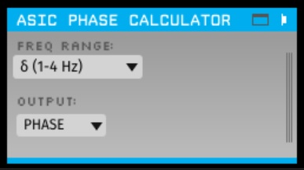

# ASIC Phase Calculator Plugin 

## Installation

This plugin must now be built outside of the main GUI file tree using CMake. In order to do so, it must be in a sibling directory to plugin-GUI\* and the main GUI must have already been compiled.

You should use this branch if you are already using CMake to build the *main GUI* (in development as of writing). Otherwise, use the `master` branch.

\* If you have the GUI built somewhere else, you can specify its location by setting the environment variable `GUI_BASE_DIR` or defining it when calling cmake with the option `-DGUI_BASE_DIR=<location>`.

I hope you find this to be useful!
-Sumedh Sopan Nagrale 
