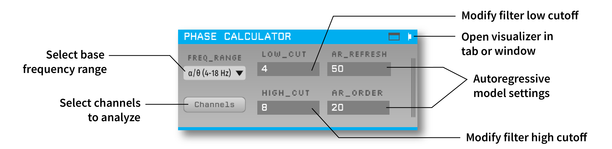

## Phase Calculator [](https://zenodo.org/badge/latestdoi/134900173)



Estimates the phase of a continuous input signal within a specified passband. It can be used to perform phase-specific closed-loop stimulation, typically in combination with the [Crossing Detector](https://github.com/open-ephys-plugins/crossing-detector).


## Installation

This plugin can be added via the Open Ephys GUI Plugin Installer. To access the Plugin Installer, press **ctrl-P** or **⌘P** from inside the GUI. Once the installer is loaded, browse to the "Phase Calculator" plugin and click "Install."

## Usage

* ***Important!*** Since the phase estimation algorithm is somewhat processor-intensive, by default only the first input channel of each stream is enabled. Use the "Channels" button to select additional channels as needed. Each selected channel will be transformed from a continuously sampled sequence of voltages into an estimate of the frequency-specific phase between -180 to +180.

* In the `FREQ_RANGE` dropdown menu, select the general frequency range to analyze. This determines which of the pre-designed Hilbert transformer filters will be used internally. Note that frequencies below 4 Hz (delta band) are too low to calculate an accurate phase estimate.

* Use `LOW_CUT` and `HIGH_CUT` to select the desired frequency passband. Changing the general frequency range will automatically set a default high and low cut, but they can be edited to filter to any band within the specified range.

* `AR_REFRESH` and `AR_ORDER` control the autoregressive model used to predict the "future" portion of the Hilbert buffer. AR parameters are estimated using Burg's method. The default settings generally work well, but alternate values (particularly a lower order) may improve the estimate in certain cases.

* Clicking the tab or window button opens the "event phase plot" view. This allows non-real-time plotting of the precise phase of received TTL events on a channel of interest. All plot controls can be used while acquisition is running. "Phase reference" subtracts the input (in degrees) from all phases (in both the rose plot and the statistics).


## Building from source

First, follow the instructions on [this page](https://open-ephys.github.io/gui-docs/Developer-Guide/Compiling-the-GUI.html) to build the Open Ephys GUI.

**Important:** This plugin is intended for use with the latest version of the GUI (0.6.0 and higher). The GUI should be compiled from the [`main`](https://github.com/open-ephys/plugin-gui/tree/main) branch, rather than the former `master` branch.

Next, install the [OpenEphysFFTW](https://github.com/open-ephys-plugins/OpenEphysFFTW) library.

Then, clone this repository into a directory at the same level as the `plugin-GUI`, e.g.:
 
```
Code
├── plugin-GUI
│   ├── Build
│   ├── Source
│   └── ...
├── OEPlugins
│   └── phase-calculator
│       ├── Build
│       ├── Source
│       └── ...
```

### Windows

**Requirements:** [Visual Studio](https://visualstudio.microsoft.com/) and [CMake](https://cmake.org/install/)

From the `Build` directory, enter:

```bash
cmake -G "Visual Studio 17 2022" -A x64 ..
```

Next, launch Visual Studio and open the `OE_PLUGIN_phase-calculator.sln` file that was just created. Select the appropriate configuration (Debug/Release) and build the solution.

Selecting the `INSTALL` project and manually building it will copy the `.dll` and any other required files into the GUI's `plugins` directory. The next time you launch the GUI from Visual Studio, the Phase Calculator plugin should be available.


### Linux

**Requirements:** [CMake](https://cmake.org/install/)

From the `Build` directory, enter:

```bash
cmake -G "Unix Makefiles" ..
cd Debug
make -j
make install
```

This will build the plugin and copy the `.so` file into the GUI's `plugins` directory. The next time you launch the compiled version of the GUI, the Phase Calculator plugin should be available.


### macOS

**Requirements:** [Xcode](https://developer.apple.com/xcode/) and [CMake](https://cmake.org/install/)

From the `Build` directory, enter:

```bash
cmake -G "Xcode" ..
```

Next, launch Xcode and open the `phase-calculator.xcodeproj` file that now lives in the “Build” directory.

Running the `ALL_BUILD` scheme will compile the plugin; running the `INSTALL` scheme will install the `.bundle` file to `/Users/<username>/Library/Application Support/open-ephys/plugins-api`. The Phase Calculator plugin should be available the next time you launch the GUI from Xcode.


## Attribution

This plugin was originally developed by [Ethan Blackwood](https://github.com/ethanbb) in the Translational NeuroEngineering Lab at the University of Minnesota. It is now maintained by the Allen Institute.

The following article describes the algorithm used by the previous version of this plugin and the closed-loop stimulation pipeline as a whole:

[Blackwood, E., Lo, M., Widge, A. S. (2018). Continuous phase estimation for phase-locked neural stimulation using an autoregressive model for signal prediction. 40th International Conference of the IEEE Engineering in Medicine and Biology Society (EMBC), Honolulu, HI, 4736-4739.](https://pubmed.ncbi.nlm.nih.gov/30441407/)
